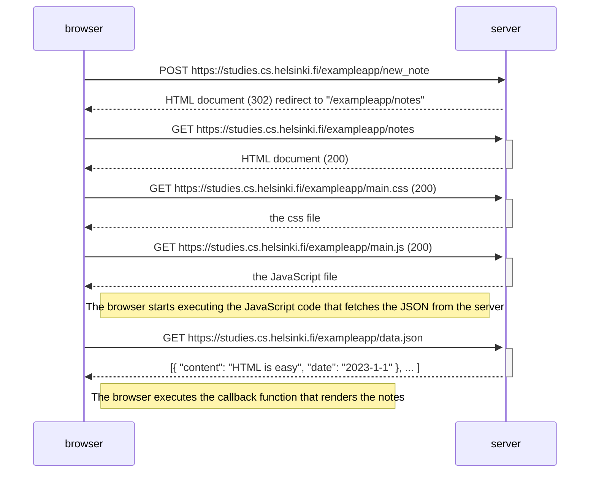

#### when the user creates a new note on the page https://studies.cs.helsinki.fi/exampleapp/notes by writing something into the text field and clicking the Save button

- one further step for posting and the server return to redirect to `exampleapp/notes` and the following requests are same as in the example

